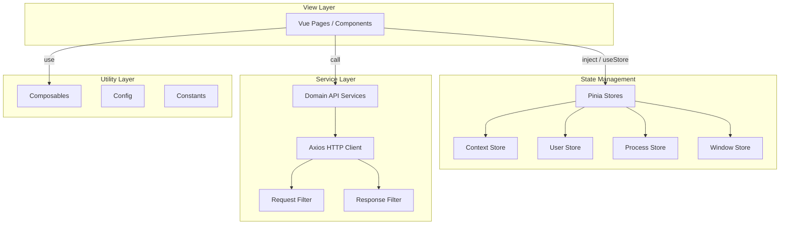

## 用户需求

在保持所有功能不变的前提下，对整体项目架构进行调整优化，使代码结构设计更加科学合理。

## 当前架构的主要问题

1. **缺少标准状态管理**：使用 `src/modules/` 下的自定义响应式对象替代 Pinia/Vuex，非 Vue 生态标准做法，团队协作和维护成本高
2. **目录命名不规范**：`server/` 存放的不是服务端代码而是前端 API 层，`modules/` 存放全局状态，`d.ts/` 混合了多种类型声明，`hooks/` 实际是 composables
3. **CSS/SCSS 变量重复定义**：`design-tokens.css` 的 CSS 自定义属性与 `index.scss` 的 SCSS 变量手动保持同步，冗余且易出错
4. **jQuery 非必要依赖**：`useMouseWheel.ts` 使用 jQuery 处理滚轮事件，在 Vue 3 项目中完全可用原生 API 替代
5. **类型声明组织混乱**：服务端类型、模块类型、Vite 环境声明、第三方库声明混放在 `d.ts/` 下
6. **API 层单体化**：所有业务 API 集中在单个 `api.ts` 文件中，随业务增长会变得难以维护
7. **组件目录结构不统一**：部分模块有 `businessTs/`、`config/` 子目录，部分没有
8. **配置文件职责混杂**：`program.ts` 同时包含 URL、Token、状态码、上下文配置
9. **路由路径 bug**：`version` 路径缺少 `/` 前缀

## 优化目标

- 引入 Pinia 作为标准状态管理方案
- 统一目录命名规范，对齐 Vue 生态标准
- 消除 CSS/SCSS 变量重复，统一设计令牌
- 移除 jQuery 依赖，使用原生 API + Vue Composables
- 重组类型声明体系
- 拆分 API 层为领域服务
- 标准化组件目录结构
- 修复路由路径 bug
- 保持所有现有功能完全不变

## 技术栈

- **框架**：Vue 3.2 + TypeScript
- **构建工具**：Vite 3
- **路由**：Vue Router 4
- **状态管理**：Pinia（新增）
- **HTTP 客户端**：Axios
- **CSS 方案**：CSS 自定义属性（design-tokens）+ Scoped CSS
- **包管理器**：Yarn

## 实现方案

### 总体策略

采用**渐进式迁移**策略，分阶段重构，每阶段独立可验证、可回滚。核心原则：先建后迁、新旧共存、验证后拆除。

### 关键技术决策

**1. 引入 Pinia 替代自研状态模块**

- 理由：Pinia 是 Vue 3 官方推荐的状态管理库，提供 DevTools 支持、TypeScript 友好、模块化设计
- 迁移策略：创建 Pinia Store 包装原有模块对象，保持 `$context`、`$user`、`$process`、`$window` 的注入方式不变，内部委托给 Pinia Store

**2. 目录结构重组**

- `src/server/` → `src/services/`（API 服务层）
- `src/modules/` → `src/stores/`（Pinia 状态管理）
- `src/d.ts/` → `src/types/`（类型声明）
- `src/hooks/` → `src/composables/`（组合式函数）
- `src/constant/` → `src/constants/`（常量定义）

**3. CSS/SCSS 统一方案**

- 保留 `design-tokens.css` 的 CSS 自定义属性作为唯一设计令牌源
- 删除 `index.scss` 中的重复变量定义
- 组件内样式中将 `$variable` 引用替换为 `var(--variable)` 引用
- 保留 SCSS 仅用于嵌套语法等编译时特性

**4. 移除 jQuery**

- 使用原生 `wheel` 事件（现代浏览器均支持）替代 jQuery `mousewheel` 事件
- 使用原生 `addEventListener` 替代 jQuery 事件绑定

**5. API 层拆分**

- 按业务领域拆分：`blog.service.ts`、`user.service.ts`、`site.service.ts` 等
- 保留统一的 HTTP 客户端（`http.ts`）和拦截器

### 架构设计

#### 新目录结构

```
src/
├── App.vue
├── main.ts
├── assets/
│   ├── css/
│   │   ├── design-tokens.css        # CSS 自定义属性（唯一设计令牌源）
│   │   └── global.css               # 全局基础样式
│   └── scss/                         # 删除，不再需要
├── components/
│   ├── common/                       # 原 general/，通用 UI 组件
│   │   ├── Pagination/
│   │   ├── button/
│   │   ├── card/
│   │   ├── image/
│   │   ├── md/
│   │   └── popup/
│   ├── layout/                       # 原 index/，布局组件
│   │   ├── AppHeader.vue
│   │   ├── AppFooter.vue
│   │   ├── AppSidebar.vue
│   │   └── AppSideCard.vue
│   └── business/                     # 原 content/，业务模块组件（结构标准化）
│       ├── blog/
│       ├── shuoshuo/
│       ├── footprint/
│       ├── music/
│       ├── video/
│       ├── joke/
│       ├── anime/
│       ├── book/
│       ├── product/
│       ├── friend/
│       ├── version/
│       └── index.ts
├── composables/                      # 原 hooks/
│   ├── useGoBoth.ts
│   ├── useMouseWheel.ts
│   ├── usePageHidden.ts
│   └── useProcessControl.ts
├── config/
│   ├── app.config.ts                 # 应用核心配置（URL、Token、状态码）
│   ├── resource.config.ts            # 静态资源路径
│   └── site.config.ts                # 站点 UI 配置
├── constants/                        # 原 constant/
│   └── index.ts
├── router/
│   ├── index.ts
│   └── path.ts
├── services/                         # 原 server/
│   ├── http.ts                       # 原 ajax.ts，Axios 实例
│   ├── filter/                       # 拦截器
│   │   ├── request.ts
│   │   └── response.ts
│   ├── helper/
│   │   ├── auth.ts
│   │   └── url.ts
│   ├── api/                          # 按领域拆分的 API
│   │   ├── site.api.ts
│   │   ├── user.api.ts
│   │   ├── blog.api.ts
│   │   ├── shuoshuo.api.ts
│   │   ├── footprint.api.ts
│   │   ├── music.api.ts
│   │   ├── video.api.ts
│   │   ├── joke.api.ts
│   │   ├── anime.api.ts
│   │   ├── book.api.ts
│   │   ├── product.api.ts
│   │   ├── friend.api.ts
│   │   └── version.api.ts
│   └── index.ts                      # 统一导出
├── stores/                           # 原 modules/，Pinia Stores
│   ├── context.ts
│   ├── process.ts
│   ├── user.ts
│   └── window.ts
├── types/                            # 原 d.ts/
│   ├── global.d.ts                   # 原 vite-env.d.ts
│   ├── api/                          # 原 d.ts/server/
│   │   ├── common.ts                 # RespInterface, ApiObject
│   │   └── models.ts                 # 业务数据模型
│   ├── store/                        # 原 d.ts/modules/
│   │   ├── context.ts
│   │   ├── process.ts
│   │   ├── user.ts
│   │   └── window.ts
│   └── index.ts                      # 原 plugin.ts，类型聚合导出
├── views/
│   ├── Index.vue
│   ├── common/
│   │   ├── Auth.vue
│   │   └── ErrorPage.vue
│   └── content/
│       ├── Home.vue
│       ├── Blog.vue
│       ├── Shuoshuo.vue
│       ├── Footprint.vue
│       ├── Music.vue
│       ├── Video.vue
│       ├── Joke.vue
│       ├── Anime.vue
│       ├── Book.vue
│       ├── Product.vue
│       ├── Friend.vue
│       ├── Version.vue
│       ├── About.vue
│       ├── anime/
│       ├── blog/
│       ├── book/
│       └── footprint/
├── libs/
│   └── statistics.js
└── plugins/
    └── index.ts
```

#### 数据流设计



### 实现细节

#### 性能考虑

- 目录重命名不影响运行时性能，仅影响构建时的模块解析
- CSS 变量替代 SCSS 变量：CSS 自定义属性在运行时解析，SCSS 变量在编译时替换，此项目的样式复杂度对此差异无感知
- Pinia Store 相比原始 reactive 对象开销微小，可忽略不计

#### 向后兼容

- 插件注入方式保持 `app.provide('$xxx', ...)` 不变，确保所有使用 `inject('$xxx')` 的组件无需修改
- Pinia Store 内部包装原有对象结构，对外接口保持一致
- API 拆分仅改变文件组织，导出接口不变

#### 日志

- 复用现有 NProgress 进度条机制
- 响应拦截器中的错误处理逻辑保持不变

#### 风险控制

- 每阶段完成后运行 `yarn dev` 验证编译通过
- 分阶段提交，每阶段独立可回滚
- 核心路径变更使用 TypeScript 的路径别名确保引用一致性